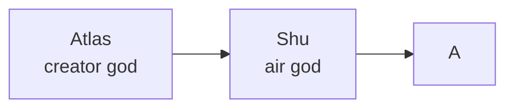

# A

[TOC]

 

## Etymology

### Greek alphabet

+ $\Alpha$ $\alpha$

 

### Egyptian mythology

 

### Folk

+ A = inverted ox head?
  + Phoenicians

+ first get an ox, then a woman
  + Works and Days
    + by Hesiod

 

## Derived terms

+ affinity
+ arbeit
  + using A for "work"
