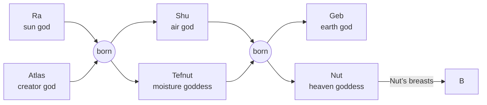

# B

[TOC]

 

## Etymology

### Greek alphabet

+ $\Beta$ $\beta$

 

### Egyptian mythology

```mermaid
graph LR;
  Ra["Ra<br>sun god"]
  Atlas["Atlas<br>creator god"]
  node1((born))
  Shu["Shu<br>air god"]
  Tefnut["Tefnut<br>moisture goddess"]
  node2((born))
  Geb["Geb<br>earth god"]
  Nut["Nut<br>heaven goddess"]
    
  Ra & Atlas-->node1-->Shu & Tefnut-->node2-->Geb & Nut
  Nut--"Nut’s breasts"-->B
```

 

## Derived terms

+ biological
