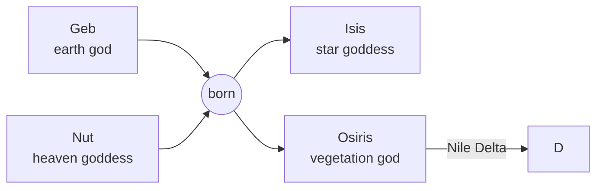

# D

[TOC]

 

## Etymology

### Greek alphabet

+ $\Delta$ $\delta$

 

### Egyptian mythology

+ Nile Delta
  + triangular island or alluvial tract between the diverging branches of the mouth of a great river

## Derived terms

+ $\Delta$
  + the symbol for "change"
  + differential
