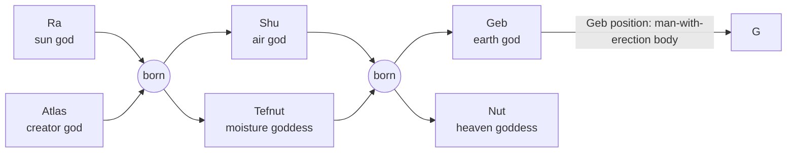

# G

[TOC]

 

## Etymology

### Greek alphabet

+ $\Gamma$ $\gamma$

 

### Egyptian mythology

+ Geb
  + who is associated with the goose, lays a golden egg
  + the sun was born out of an egg

 

## Derived terms

+ based on the "earth"
  + Geo
  + Geocentric
  + Geocentrism
  + Geology

+ reproduction
  + Gonad
  + Gene
  + Genetics
  + Genesis
  + Germ cell
  + Gland

+ mind
  + Genius

+ math
  + Geometry
  + Gematria
  + Algebra
    + al-Geb-ra

+ Other
  + Good
  + God
  + Great
