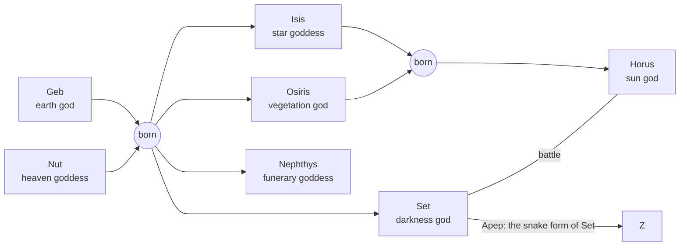

# Z

[TOC]

 

## Etymology

### Greek alphabet

+ $\Zeta$ $\zeta$

 

### Egyptian mythology

```mermaid
graph LR;
  Geb["Geb<br>earth god"]
  Nut["Nut<br>heaven goddess"]
  node1((born))
  Isis["Isis<br>star goddess"]
  Osiris["Osiris<br>vegetation god"]
  Nephthys["Nephthys<br>funerary goddess"]
  Set["Set<br>darkness god"]
  node2((born))
  Horus["Horus<br>sun god"]

  Geb & Nut-->node1---->Isis & Osiris & Nephthys & Set
  Isis & Osiris-->node2-->Horus
  Set--"battle"---Horus
  Set--"Apep: the snake form of Set"-->Z
```
