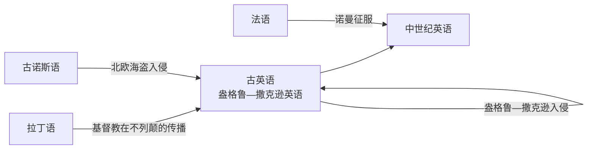

# 英语发展史

[TOC]

 

## 概述

### 分期年代表

<dl>

<dt>449—1066</dt>
<dd>古英语</dd>

<dt>1066—1489</dt>
<dd>中世纪英语</dd>

<dt>1489—1801</dt>
<dd>早期现代英语</dd>

<dt>1801—今</dt>
<dd>现代英语</dd>

</dl>

 

## 隶属关系

+ 盎格鲁—撒克逊英语 $\in$ 日耳曼语族 $\in$ 印欧语系

 

## 英语的形成

<dl>

<dt>449</dt>
<dd>盎格鲁—撒克逊人入侵不列颠</dd>

<dt>597</dt>
<dd>奥古斯丁开始在英国传播基督教</dd>

<dt>787</dt>
<dd>北欧海盗开始入侵英国</dd>

<dt>1066</dt>
<dd>诺曼征服</dd>

</dl>

 

>> 参考文献

英语发展史 张勇先 外语教学与研究出版社
