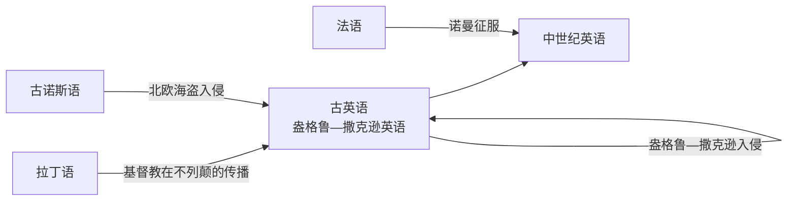
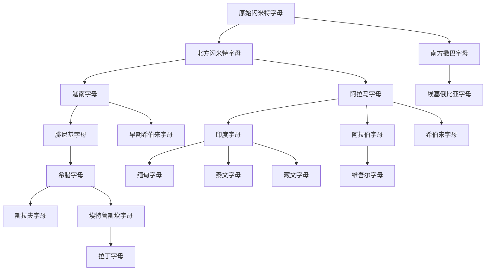
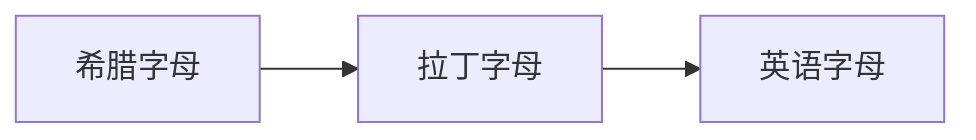

# 英语发展史

[TOC]

 

## 分期年代表

<dl>

<dt>449—1066</dt>
<dd>古英语</dd>

<dt>1066—1489</dt>
<dd>中世纪英语</dd>

<dt>1489—1801</dt>
<dd>早期现代英语</dd>

<dt>1801—今</dt>
<dd>现代英语</dd>

</dl>

 

## 隶属关系

+ 盎格鲁—撒克逊英语 $\in$ 日耳曼语族 $\in$ 印欧语系

 

## 英语的形成

<dl>

<dt>449</dt>
<dd>盎格鲁—撒克逊人入侵不列颠</dd>

<dt>597</dt>
<dd>奥古斯丁开始在英国传播基督教</dd>

<dt>787</dt>
<dd>北欧海盗开始入侵英国</dd>

<dt>1066</dt>
<dd>诺曼征服</dd>

</dl>

 

## 字母

+ 字母系统发展示意图

+ 英语字母

 

+ alphabet
  + 字母表
  + letters of a language arranged in customary order
  + alpha + beta

 

+ 字母名称的演变

<table>
  <tr>
    <th colspan="2">希伯来</th>
    <th colspan="2">希腊</th>
    <th colspan="2">拉丁</th>
  </tr>
  <tr>
    <td>aleph</td>
    <td>牛</td>
    <td>&Alpha;</td>
    <td>alpha</td>
    <td>A</td>
    <td>a</td>
  </tr>
  <tr>
    <td>beth</td>
    <td>房子</td>
    <td>&Beta;</td>
    <td>beta</td>
    <td>B</td>
    <td>be</td>
  </tr>
  <tr>
    <td>gimel</td>
    <td>骆驼</td>
    <td>&Gamma;</td>
    <td>gamma</td>
    <td>(C)</td>
    <td>ke</td>
  </tr>
  <tr>
    <td></td>
    <td></td>
    <td></td>
    <td></td>
    <td>G</td>
    <td>ge</td>
  </tr>
  <tr>
    <td>daleth</td>
    <td>门</td>
    <td>&Delta;</td>
    <td>delta</td>
    <td>D</td>
    <td>de</td>
  </tr>
  <tr>
    <td>he</td>
    <td>（声音）</td>
    <td>&Epsilon;</td>
    <td>epsilon</td>
    <td>E</td>
    <td>e</td>
  </tr>
  <tr>
    <td>waw</td>
    <td>钩子</td>
    <td></td>
    <td></td>
    <td>F</td>
    <td>ef</td>
  </tr>
  <tr>
    <td>zayin</td>
    <td>橄榄</td>
    <td>&Zeta;</td>
    <td>zeta</td>
    <td>Z</td>
    <td>zet</td>
  </tr>
  <tr>
    <td>kheth</td>
    <td>栅栏</td>
    <td>&Eta;</td>
    <td>eta</td>
    <td>H</td>
    <td>ha</td>
  </tr>
  <tr>
    <td>teth</td>
    <td>球</td>
    <td>&Theta;</td>
    <td>theta</td>
    <td></td>
    <td></td>
  </tr>
  <tr>
    <td>yodh</td>
    <td>手</td>
    <td>&Iota;</td>
    <td>iota</td>
    <td>I</td>
    <td>i</td>
  </tr>
  <tr>
    <td></td>
    <td></td>
    <td></td>
    <td></td>
    <td>(J)</td>
    <td></td>
  </tr>
  <tr>
    <td>kaph</td>
    <td>手掌</td>
    <td>&Kappa;</td>
    <td>kappa</td>
    <td>K</td>
    <td>ka</td>
  </tr>
  <tr>
    <td>lamedh</td>
    <td>短棍</td>
    <td>&Lambda;</td>
    <td>lambda</td>
    <td>L</td>
    <td>el</td>
  </tr>
  <tr>
    <td>men</td>
    <td>水</td>
    <td>&Mu;</td>
    <td>mu</td>
    <td>M</td>
    <td>em</td>
  </tr>
  <tr>
    <td>nun</td>
    <td>鱼</td>
    <td>&Nu;</td>
    <td>nu</td>
    <td>N</td>
    <td>en</td>
  </tr>
  <tr>
    <td>samekh</td>
    <td>支柱</td>
    <td>&Xi;</td>
    <td>xi</td>
    <td></td>
    <td></td>
  </tr>
  <tr>
    <td>ayin</td>
    <td>眼</td>
    <td>&Omicron;</td>
    <td>omicron</td>
    <td>O</td>
    <td>o</td>
  </tr>
  <tr>
    <td>pe</td>
    <td>口</td>
    <td>&Pi;</td>
    <td>pi</td>
    <td>P</td>
    <td>pe</td>
  </tr>
  <tr>
    <td>sadhe</td>
    <td>钓竿</td>
    <td></td>
    <td></td>
    <td></td>
    <td></td>
  </tr>
  <tr>
    <td>qoph</td>
    <td>猴子</td>
    <td></td>
    <td></td>
    <td>Q</td>
    <td>ku</td>
  </tr>
  <tr>
    <td>resh</td>
    <td>头</td>
    <td>&Rho;</td>
    <td>rho</td>
    <td>R</td>
    <td>er</td>
  </tr>
  <tr>
    <td>sin(shin)</td>
    <td>牙齿</td>
    <td>&Sigma;</td>
    <td>sigma</td>
    <td>S</td>
    <td>es</td>
  </tr>
  <tr>
    <td>taw</td>
    <td>记号</td>
    <td>&Tau;</td>
    <td>tau</td>
    <td>T</td>
    <td>te</td>
  </tr>
  <tr>
    <td></td>
    <td></td>
    <td>&Upsilon;</td>
    <td>upsilon</td>
    <td>(U)</td>
    <td>u</td>
  </tr>
  <tr>
    <td></td>
    <td></td>
    <td></td>
    <td></td>
    <td>V</td>
    <td>ve</td>
  </tr>
  <tr>
    <td></td>
    <td></td>
    <td></td>
    <td></td>
    <td>(W)</td>
    <td></td>
  </tr>
  <tr>
    <td></td>
    <td></td>
    <td>&Phi;</td>
    <td>phi</td>
    <td></td>
    <td></td>
  </tr>
  <tr>
    <td></td>
    <td></td>
    <td>&Chi;</td>
    <td>chi</td>
    <td>X</td>
    <td>iks</td>
  </tr>
  <tr>
    <td>gimel</td>
    <td>骆驼</td>
    <td>&Gamma;</td>
    <td>gamma</td>
    <td>C</td>
    <td>ke</td>
  </tr>
  <tr>
    <td></td>
    <td></td>
    <td>&Psi;</td>
    <td>psi</td>
    <td>Y</td>
    <td>ypsilon</td>
  </tr>
  <tr>
    <td></td>
    <td></td>
    <td>&Omega;</td>
    <td>omega</td>
    <td></td>
    <td></td>
</table>

 

## 文学与文献资料

+ 圣经

 

>> 参考文献

英语发展史 张勇先 外语教学与研究出版社
